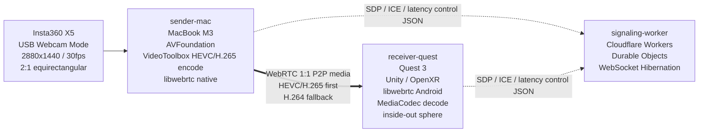

# Architecture

## 全体構成図

## 各コンポーネントの責務

`sender-mac` は X5 を UVC カメラとして取得し、2880x1440 / 30fps / 2:1 equirectangular の映像を VideoToolbox で HEVC/H.265 低遅延ハードウェアエンコードします。H.264 fallback も残します。WebRTC PeerConnection を作り、Quest 3 へ P2P 送信します。

`signaling-worker` は Cloudflare Workers + Durable Objects の WebSocket サーバーです。1 room = 1 Durable Object とし、sender と receiver の 2 接続だけを許可します。SDP、ICE candidate、軽量な遅延測定制御メッセージだけを中継します。

`receiver-quest` は Unity Quest 3 アプリです。libwebrtc Android で映像を受信し、MediaCodec の HEVC/H.265 ハードウェアデコード経路に乗せます。受信した equirectangular texture を inside-out sphere に貼り、OpenXR で HMD 表示します。

## 映像経路

実際の映像経路は MacBook M3 から Quest 3 への WebRTC P2P です。Cloudflare は映像、音声、RTP、RTCP、フレームデータを一切扱いません。

## Cloudflare が中継するもの

- SDP offer
- SDP answer
- ICE candidate
- `latency-sync`
- `latency-echo`
- `join` / `joined` / `peer-joined` / `peer-left` / `ping` / `pong` / `error`

## SFU を使わない理由

この MVP は 1:1 のテレプレゼンスが目的です。SFU は多人数配信や複数購読者がいる場合に有効ですが、RTP を受けて転送するメディアサーバーを入れると、運用コスト、遅延要因、コーデック対応の検証面が増えます。まずは MacBook M3 と Quest 3 の P2P 性能を直接測ります。

## 1:1 前提の理由

X5 の 2880x1440 / 30fps 360 度映像は帯域とデコード負荷が大きいため、初期 MVP では sender 1 台、receiver 1 台に限定します。Durable Object も sender/receiver を各 1 接続だけ許可し、重複 role を拒否します。

## HEVC/H.265 first の理由

HEVC/H.265 は 360 度映像のような高解像度入力で H.264 より圧縮効率を得やすく、MacBook M3 の VideoToolbox hardware encode と Quest 3 の MediaCodec hardware decode を活用できる可能性があります。Phase 1 では HEVC/H.265 を初手にします。

## H.264 fallback を残す理由

WebRTC 実装によって HEVC/H.265 の negotiation、packetization、decoder 経路が難しい場合があります。HEVC が成立しない場合でも MVP を止めないため、H.264 fallback を残します。H.264 は遅延基準値の比較にも使います。

