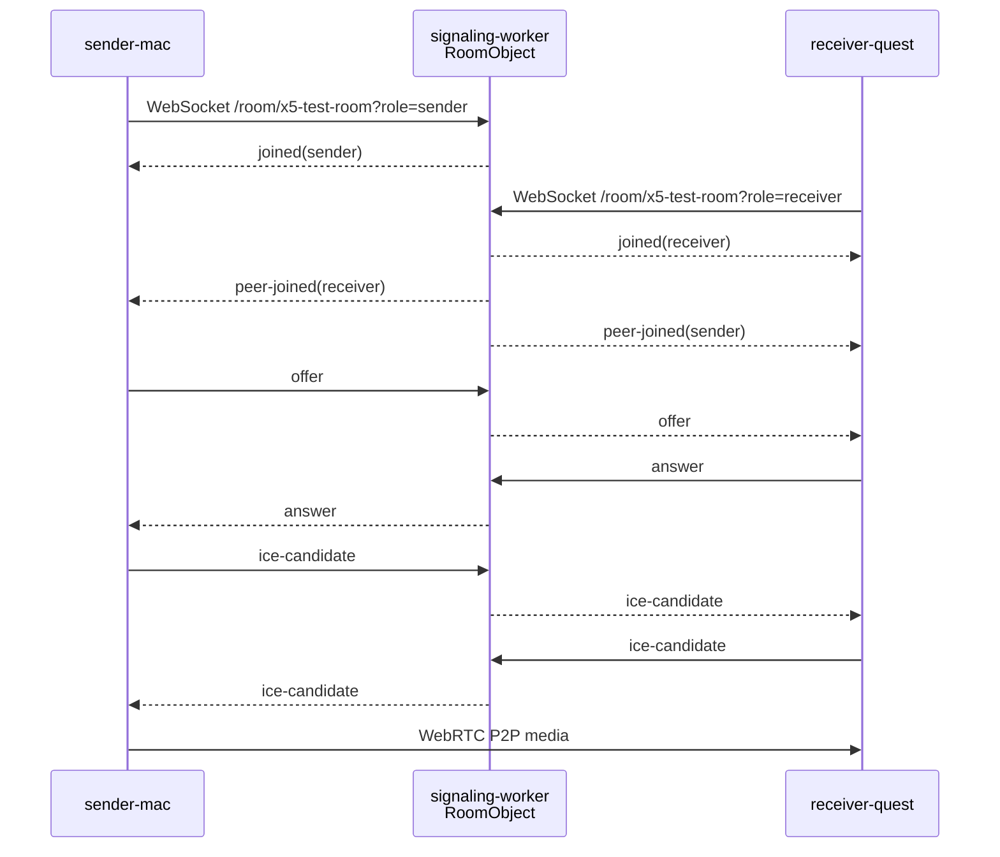
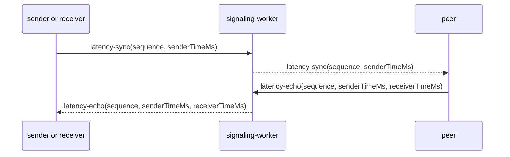

# Signaling Protocol

signaling-worker は WebRTC 1:1 P2P のためのシグナリング専用サーバーです。メディアは扱いません。

## 接続

```text
/room/:roomId?role=sender
/room/:roomId?role=receiver
```

- `roomId` は空にできません。
- `role` は `sender` または `receiver` のみです。
- 同じ room には sender 1 接続、receiver 1 接続だけを許可します。
- WebSocket upgrade 以外は `426` を返します。
- `/healthz` は `200` を返します。

## JSON messages

client -> server:

| type | 送信元 | 説明 |
| --- | --- | --- |
| `join` | sender/receiver | URL の room/role と一致するか確認する任意の join メッセージ |
| `offer` | sender | SDP offer を receiver へ転送 |
| `answer` | receiver | SDP answer を sender へ転送 |
| `ice-candidate` | sender/receiver | ICE candidate を相手へ転送 |
| `leave` | sender/receiver | 切断し、相手へ `peer-left` を通知 |
| `ping` | sender/receiver | `pong` を返す |
| `latency-sync` | sender/receiver | 測定用 sync を相手へ転送 |
| `latency-echo` | sender/receiver | 測定用 echo を相手へ転送 |
| `receiver-log` | receiver | receiver の診断ログを sender へ転送 |

server -> client:

| type | 説明 |
| --- | --- |
| `joined` | 接続 role と roomId を通知 |
| `peer-joined` | 相手 role が接続したことを通知 |
| `offer` | 相手からの SDP offer |
| `answer` | 相手からの SDP answer |
| `ice-candidate` | 相手からの ICE candidate |
| `peer-left` | 相手 role が離脱したことを通知 |
| `pong` | `ping` への応答 |
| `error` | バリデーション、重複 role、相手未接続などのエラー |
| `latency-sync` | 相手からの latency sync |
| `latency-echo` | 相手からの latency echo |
| `receiver-log` | receiver から sender への診断ログ |

## role 別に送れるメッセージ

- sender は `offer` を送れます。
- receiver は `answer` を送れます。
- `ice-candidate` は sender/receiver の両方が送れます。
- `latency-sync` と `latency-echo` は sender/receiver の両方が送れます。
- `receiver-log` は receiver だけが送れます。小さい診断テキストのみを扱い、media path には使いません。
- `leave` と `ping` は sender/receiver の両方が送れます。

role 不一致の場合は `error` を返します。

## エラー仕様

- JSON parse error: `{ "type": "error", "message": "invalid JSON" }`
- 不明または不正な message type: `{ "type": "error", "message": "unknown or invalid message: ..." }`
- duplicate role: `{ "type": "error", "message": "duplicate role: sender" }` を送って接続を閉じる
- peer 未接続: `{ "type": "error", "message": "peer is not connected: receiver" }`
- role 不一致: `{ "type": "error", "message": "offer is only allowed from sender" }`

MVP では保留キューはありません。相手が未接続なら転送せず `error` を返します。

## 接続シーケンス



## latency-sync / latency-echo



これは signaling 経路の軽量制御メッセージ確認用です。実際の映像遅延測定では WebRTC DataChannel の `frame-timestamp` を本命にします。
